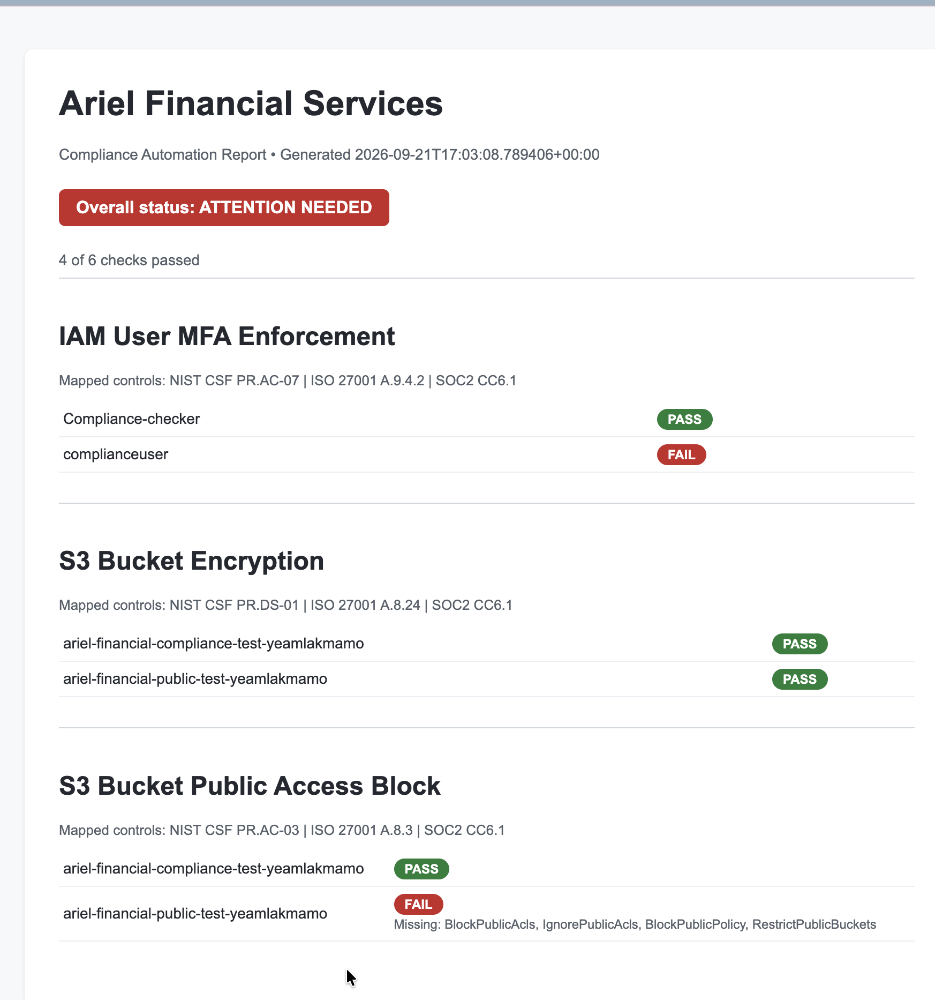

# Compliance Automation Toolkit

A Python-based toolkit that automates cloud security compliance checks against major frameworks (NIST CSF, ISO 27001, SOC 2) — modeled after the continuous control monitoring approach used by commercial GRC platforms like Vanta and Drata.

Built as part of a broader compliance program I developed for a fictional financial services company, **Ariel Financial Services**, including a NIST CSF risk assessment, security policy suite, and this automated evidence collection layer.

## What it does

Instead of manually screenshotting AWS console settings for an audit, this toolkit connects (read-only) to an AWS account and automatically checks real security configurations against specific compliance controls — then generates a single HTML report summarizing the results.

## Controls checked

| Check | What it verifies | Mapped Controls |
|---|---|---|
| IAM MFA Enforcement | Every IAM user has multi-factor authentication enabled | NIST CSF PR.AC-07, ISO 27001 A.9.4.2, SOC 2 CC6.1 |
| S3 Bucket Encryption | Every S3 bucket has server-side encryption enabled | NIST CSF PR.DS-01, ISO 27001 A.8.24, SOC 2 CC6.1 |
| S3 Public Access Block | Every S3 bucket has all public access settings blocked | NIST CSF PR.AC-03, ISO 27001 A.8.3, SOC 2 CC6.1 |

## Sample output

Running the toolkit generates an HTML compliance dashboard summarizing pass/fail status across all checks:



## Setup

1. Clone this repo
2. Install dependencies:
   ```
   pip install -r requirements.txt
   ```
3. Configure AWS credentials locally (a read-only IAM user with the `SecurityAudit` managed policy is recommended — this toolkit never modifies any resources):
   ```
   aws configure
   ```
4. Run an individual check:
   ```
   python check_mfa.py
   python check_s3_encryption.py
   python check_s3_public_access.py
   ```
5. Or generate the full combined report:
   ```
   python run_all_checks.py
   ```
   This produces `report.html` in the project folder.

## Why this project

Compliance teams spend significant time manually collecting evidence for audits — checking settings, taking screenshots, and re-verifying them every few months. Continuous control monitoring tools address this by connecting directly to cloud environments and checking configurations automatically, on an ongoing basis, mapped directly to the specific framework language auditors look for.

This project is a small-scale demonstration of that same core idea: read-only, framework-mapped, automated evidence collection.

## Future work

- Additional checks (security group rules, CloudTrail logging status, password policy)
- Scheduled/automated runs (e.g., via cron or GitHub Actions) for true continuous monitoring
- Export to CSV in addition to HTML
- A lightweight web dashboard instead of a static HTML file

## Tech stack

Python, boto3 (AWS SDK)

---

Part of a larger GRC portfolio — see my [potfolio site link] for the full Ariel Financial Services compliance program, including risk assessments and security policy documentation.
